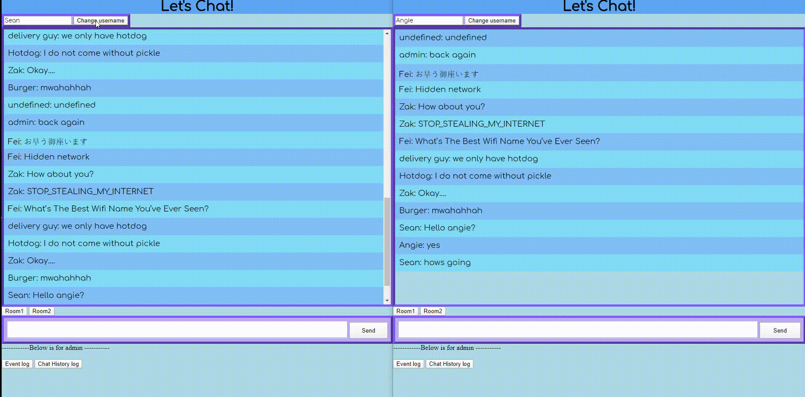

Simple Web Based Chat for Fullstack Development III - Blockchain Development  

# Chat App Demo

This is chat application with message and events history using Node.js, Socket.IO and ReactJS.
- change chat room
- chat and display "__ is typing"
- display chat and log history
- change name

### 

---

==================================================================================

## To run the whole project, please refer to README.md in FS4_Project

Heroku URL: 
                https://serene-falls-19141.herokuapp.com/
                

    ** ALTERNATIVELY **
    ===================              
# Please install dependencies by running:
                                                "npm i"

# Start application by runing:
                                                "node app.js"

# View app at:
                                                "https://localhost:5000"

